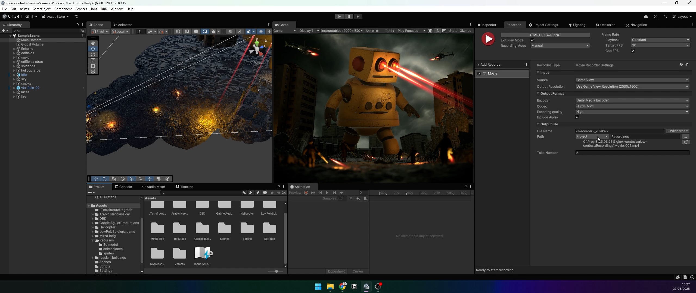

# Laser-Eyed Instructables Robot: A Glowing Apocalyptic Adventure



## Overview
This project, created for the **Make it Glow - Visual Effects Student Contest** on Instructables.com, brings the iconic Instructables robot to life in a thrilling apocalyptic scene. Built in **Unity 6** with the Universal Render Pipeline (URP), the project features a towering robot with glowing laser eyes, crumbling buildings, soldiers, helicopters, and dynamic lighting effects like muzzle flashes, lightning, and fire. The scene is enhanced with post-processing for a cinematic, glowing atmosphere, perfect for the contest theme.

## Features
- **Glowing Effects**: Laser beams from the robot’s eyes, muzzle flashes, lightning, and ambient embers.
- **3D Environment**: A destroyed city with tilted buildings, rubble, and a stormy sky.
- **Animations**: Soldier movements, helicopter rotors, and an idle animation for the Instructables robot.
- **Post-Processing**: Vignette, chromatic aberration, and film grain for a dramatic look.
- **Audio**: War and battle sound effects from Pixabay for immersion.

## Tools and Materials
- **Unity 6 (version 6000.0.28f1)**: Core game engine.
- **Online Tools**: [Hyper3D.ai](https://hyper3d.ai) for 3D model generation, [Mixamo.com](https://www.mixamo.com) for animations.
- **Image Editor**: For texture tweaks (e.g., GIMP or Photoshop).
- **Video Editor**: For final composition (e.g., Adobe Premiere or DaVinci Resolve).
- **Unity Asset Store**: Various assets for buildings, soldiers, helicopters, and particles.

## Key Steps
1. **Concept**: Designed an apocalyptic scene with a laser-eyed Instructables robot.
2. **Setup**: Created a Unity project with URP and blocked out the scene with primitive shapes.
3. **Assets**: Imported assets from the Unity Asset Store for buildings, soldiers, and effects.
4. **Robot Creation**: Generated a 3D model of the Instructables robot using Hyper3D.ai and animated it via Mixamo.
5. **Lighting**: Added point lights for glowing effects (lasers, muzzle flashes, lightning) and removed default lighting for a night scene.
6. **Post-Processing**: Applied vignette, chromatic aberration, and film grain for a cinematic look.
7. **Animation**: Used Unity’s Animator for soldiers and rotors, and scripts for dynamic effects like flashes.
8. **Export**: Recorded the scene with Unity Recorder and added war sound effects from Pixabay.

## Installation
1. Clone this repository:  
   ```bash
   git clone https://github.com/iasarmientoj/glow-contest.git
   ```
2. Open the project in **Unity Hub** with Unity 6 (version 6000.0.28f1).
3. Ensure the **Universal Render Pipeline (URP)** is configured.
4. Import assets from the Unity Asset Store (links in the Instructable).
5. Follow the Instructable for detailed setup: [Instructables Link](https://www.instructables.com/Instructables-Robot-Laser-Battle-Scene-in-Unity/).

## Usage
- Open the main scene in Unity to explore the setup.
- Adjust lighting, animations, or post-processing in the Unity Editor to customize.
- Use **Unity Recorder** to export the final video.
- Add audio in a video editor using the provided sound effect links.

## Credits
- **Sound Effects**: Sourced from Pixabay by [WilliamHector](https://pixabay.com/users/williamhector-50334546/) and [freesound_community](https://pixabay.com/users/freesound_community-46691455/).
- **Instructables**: Inspiration from the iconic robot logo.
- **Contest**: Submitted to the "Make it Glow - Visual Effects Student Contest."

## License
This project is for educational and non-commercial use, created for the Instructables contest. Assets and sound effects are subject to their respective licenses.

---

**Note**: For a detailed step-by-step guide, check out the full Instructable at [Instructables.com](https://www.instructables.com/Instructables-Robot-Laser-Battle-Scene-in-Unity/). Upload your own screenshot as `screenshot.png` in this repository to showcase the project!